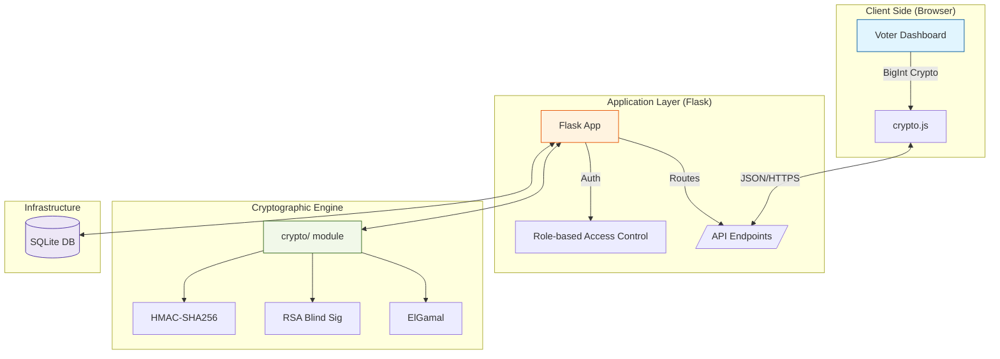
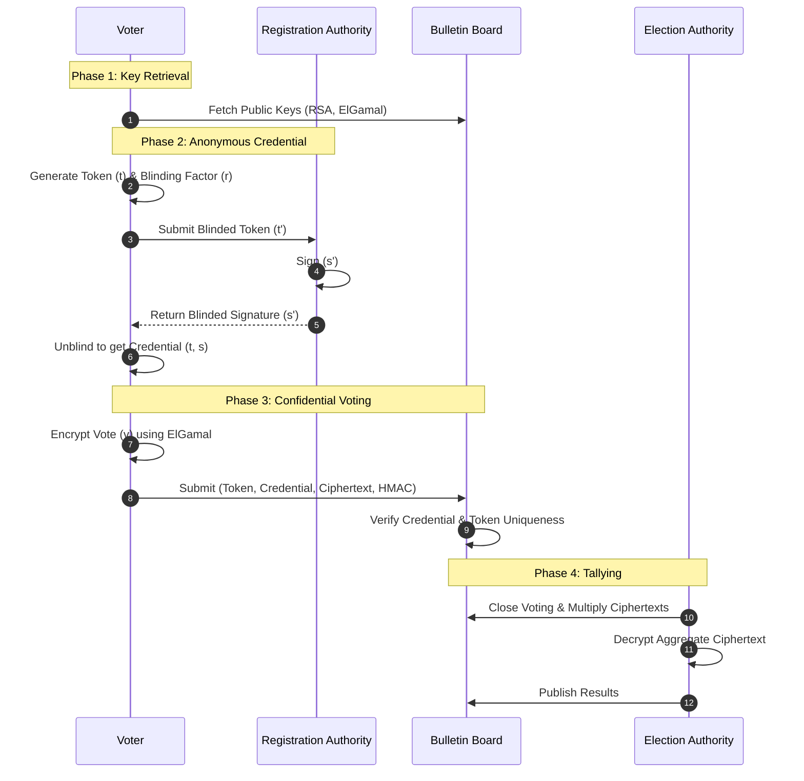
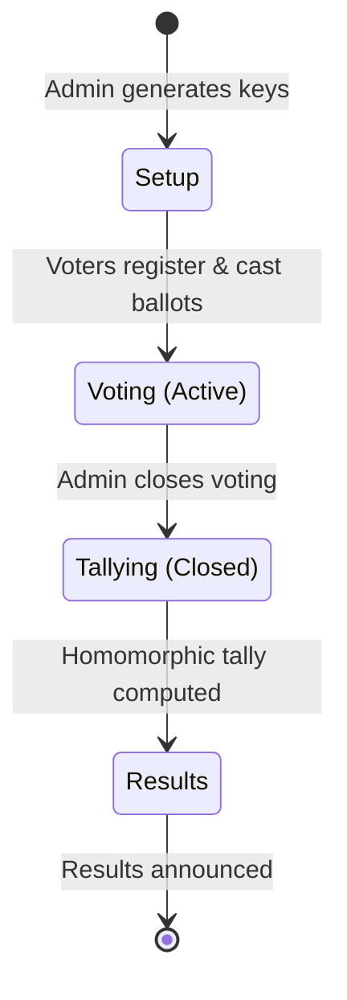

# SecureVote: A Cryptographic E-Voting Demo

> **Midterm Project** | Cryptography Course
> A practical implementation of privacy-preserving protocols for digital democracy.

---

## Overview
SecureVote is an end-to-end encrypted electronic voting system designed to demonstrate how advanced cryptography can ensure **anonymity**, **integrity**, and **verifiability**. 

Unlike traditional systems, SecureVote uses **Blind Signatures** to decouple identity from credentials and **Homomorphic Encryption** to tally results without ever decrypting individual ballots.

> **Academic Demo Only**: This project is built for educational demonstration. It is NOT production-ready and should not be used for actual elections without significant hardening.

### Core Architecture
SecureVote implements a **three-authority architecture** to ensure anonymous and verifiable voting:

| Authority | Role | Key Material |
|---|---|---|
| **Election Authority (EA)** | Manages lifecycle, decrypts final tally | ElGamal keypair |
| **Registration Authority (RA)** | Issues credentials via blind signature | RSA keypair |
| **Voter** | Casts encrypted ballots anonymously | Ephemeral token |

### System Guarantees
- **Ballot Secrecy**: No one can link a vote to a voter (blind signatures).
- **Universal Verifiability**: Anyone can verify the tally via the public board.
- **Eligibility**: Only registered voters with valid codes can vote.
- **Double-Vote Prevention**: Unique token hashes enforced at the DB level.
- **Integrity Protection**: HMAC-SHA256 prevents tampering in transit.

---

## System Architecture

### 1. System Architecture
SecureVote follows a modular architecture where the Flask backend orchestrates interactions between the browser, a persistent ledger, and a high-performance cryptographic engine.



### 2. End-to-End Cryptographic Flow
The "Blind & Encrypt" workflow ensures that the system knows *who* voted and *what* was voted, but never both simultaneously for the same person.



### 3. Election Lifecycle
The election follows a strict state-based transition managed by the administrator.



---

## Database Schema
The system uses a lightweight SQLite database to store election state and the public bulletin board.

| Table | Key Columns | Purpose |
|---|---|---|
| `election_config` | `eg_p`, `eg_g`, `rsa_N` | Stores public keys & election status |
| `voters` | `voter_id`, `secret_code` | Manages eligibility & login credentials |
| `ballots` | `token_hash`, `c1`, `c2` | The Public Bulletin Board (encrypted) |

---

## Cryptographic Protocols

### [RSA Blind Signatures](crypto/blind_sig.py) (Anonymity)
Based on David Chaum's protocol (1983). It allows the Registration Authority to authorize a voter without seeing the actual "voting token." 
- **The Magic**: The RA signs a blinded version of the token. The voter then "unblinds" it to get a valid signature on the original token.

### [ElGamal Homomorphic Encryption](crypto/elgamal.py) (Privacy)
Individual votes are encrypted with the Election Authority's public key.
- **The Magic**: $E(v_1) \cdot E(v_2) = E(v_1 + v_2)$. 
- We multiply all encrypted ballots together and decrypt the **aggregate** only. No individual vote is ever revealed.

### [HMAC-SHA256](crypto/hmac_utils.py) (Integrity)
Protects against "Man-in-the-middle" attacks by ensuring that neither the encrypted ballot nor the credentials can be modified during transit.

---

## Getting Started

### 1. Installation
```bash
# Clone and enter the project
git clone https://github.com/MRXz194/E-voting.git
cd E-voting

# Install dependencies
pip install -r requirements.txt
```

### 2. Run the App
```bash
python app.py
```
Open your browser at [http://localhost:5000](http://localhost:5000).

### 3. Quick Demo Guide
1. **Admin Setup**: Login as `admin`/`admin`. Initialize the election and generate keys.
2. **Add Voters**: Create demo voters and copy their **Secret Codes**.
3. **Voting**: Logout and login as a Voter. Follow the 4-step wizard to cast an anonymous ballot.
4. **Tallying**: Login as Admin, close the voting, and watch the homomorphic tally compute the winner!

---

## Tech Stack
- **Backend**: Python 3.10+ / Flask 3.0
- **Database**: SQLite (SQLAlchemy)
- **Crypto Engine**: Pure Python (Built from scratch in `crypto/`)
- **Testing**: Pytest (25+ security-focused tests)

---

## Technical Highlights
- **Discrete Log Solver**: Uses the **Baby-Step Giant-Step (BSGS)** algorithm for efficient tallying.
- **Public Ledger**: An append-only bulletin board for full election transparency.
- **Zero-Knowledge Context**: Includes tests demonstrating the need for ZK-Proofs to prevent vote inflation.

---

## Optional: High-Load Infrastructure
For scenarios requiring asynchronous processing (e.g., thousands of concurrent RSA signings), the system supports:
- **Task Queue**: Celery 5.4
- **Broker**: Redis 5.0
- **Usage**: Offloads RSA modular exponentiation to background workers.

---

## Disclaimer
This project is an academic exercise. For production environments, it would require Threshold ElGamal, Zero-Knowledge Proofs for ballot validity, and hardware security modules (HSM) for key management.
